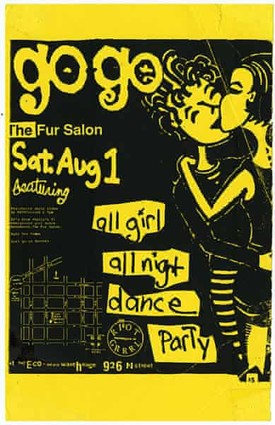

# Coding

## The artifact

Collection Fabiola

[Collection Summary: Collectie Fabiola](https://search.iisg.amsterdam/Record/COLL00016)

A Collection of 17 diaries I found by looking for collections without looking for anything specific. The diaries include a report on Fabiola's life and responses to social issues such as the squatters' movement and discrimination.

- The diaries

    

    

    

    

    

## Transcoding ideas

- Digital diary website
    - An online platform where people could share there daily thought that they would normally write in a diary.
- Zines made with queer icons (a website where you could also print these zines)
    - [riot grrrl](https://www.theguardian.com/music/gallery/2013/jun/30/punk-music)
    - [pansy beat](https://i-d.vice.com/en_us/article/3k5djj/pansy-beat-zine-captured-the-80s-east-village-queer-scene) (queer zine from the 80's)
    - [J.D.s](https://www.dazeddigital.com/music/gallery/22438/1/j-d-s) (queer punk zine from the 80's)
- Instagram filter
- Instagram poetry website

## The diary

Diaries, the from the Latin word dies for ‘day’, are records of daily life and opinions organized by date. The art of diary-keeping became popular in the 18th century, and the peak reached its pinnacle during the **[Victorian era](https://en.wikipedia.org/wiki/Victorian_era)**.

While diaries were usually meant to record the private thoughts of the diarist, they now give us important insights into historical events and the everyday life of the culture in which the diarist lived.

### Diary for the future

In the future people are going to look back at 2020 and try to imagine how it looked like. So having peoples private thoughts and opinions is crucial. 

### The website

A website where each day you can share your thoughts and feelings. On the website you will be able to see what other people write. 

## References

- Anne Frank diary

- [Twitter](https://twitter.com/explore)
- [Jaap Smit A Tweet History](https://jaapsmit.nl/A-Tweet-History)

---

### First sketch for website

---

## Queer zine

Zines made with queer icons (a website where you could also print these zines). A zine for the queer icons from today, but still made in the way they used to make zines in the 80's 

### References

- [riot grrrl](https://www.theguardian.com/music/gallery/2013/jun/30/punk-music)
- [pansy beat](https://i-d.vice.com/en_us/article/3k5djj/pansy-beat-zine-captured-the-80s-east-village-queer-scene) (queer zine from the 80's)
- [J.D.s](https://www.dazeddigital.com/music/gallery/22438/1/j-d-s) (queer punk zine from the 80's)
- [Queercore](https://en.wikipedia.org/wiki/Queercore)

    

    
