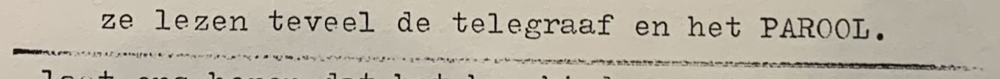

# A digital reading experience

### **Table of Contents**

1. [Artefact](https://github.com/fabiolavdberg/Diaries_Fabiola#artefact)
    1. [Metadata](https://github.com/fabiolavdberg/Diaries_Fabiola#metadata)
2. [Research](https://github.com/fabiolavdberg/Diaries_Fabiola#research-h1)
3. [Transcoding](https://github.com/fabiolavdberg/Diaries_Fabiola#transcoding)
    1. [Transcoding No. 1](https://github.com/fabiolavdberg/Diaries_Fabiola#transcoding-no-1)
    2. [Transcoding No 2 ](https://github.com/fabiolavdberg/Diaries_Fabiola#transcoding-no-2) 
    3. [Transcoding Tool](https://github.com/fabiolavdberg/Diaries_Fabiola#transcoding-tool)
4. [Reflection](https://github.com/fabiolavdberg/Diaries_Fabiola#reflection)
5. [Outcome](https://github.com/fabiolavdberg/Diaries_Fabiola#outcome)
6. [Conclusion](https://github.com/fabiolavdberg/Diaries_Fabiola#conclusion)
7. [Bibliography](https://github.com/fabiolavdberg/Diaries_Fabiola#bibliography)

# **Artefact, Collection of 17 diaries**

A Collection of 17 diaries made/written by Fabiola. The diaries include a report on Fabiola's life and responses to social issues such as the squatters' movement and discrimination.

## **Metadata**

| Tag | Data |  
|--|--|
**IISG Call Number** | [COLL00016](https://search.iisg.amsterdam/Record/COLL00016)
| **Physical Description** | 17 diaries 
| **Type** | Object
| **Medium** | Diaries
| **Materials** | Various types of material
| **Date** | 1985-1987
|| Here you can see the diaries made by Fabiola. They are all handmade with various types of material.

# Collection of 17 diaries

Fabiola made a series of diaries in 1985, 1986, and 1987. These diaries are not chronological reports, but works of art. They offer a candid account of his daily changing moods, from happy, sad, to depressed. Fabiola frequently reminisced in the diaries about his childhood in Germany and later Belgium. Especially interesting are the comments that Fabiola delivers on political events. Sometimes he gives an account of a meeting in the squatters’ environment, and then a demonstration against fascism or for gay rights. [[2]](https://search.iisg.amsterdam/Record/COLL00016) Here is a [link](https://drive.google.com/open?id=1hHOJIRWUvFfzKZ-ryD-QP0clewo_T_Ku) to pictures of the diaries.

All Diaries

    
[Dagboek 4](https://drive.google.com/open?id=1jL2Ia04yqGbvGp4LPPtJWrnr1xAIlL9K)

[Dagboek 6](https://drive.google.com/open?id=1VfEXZkEE5LiDxGG6hrjo8vP1f78obJ7O)

[Dagboek 7](https://drive.google.com/open?id=13Kfmw0j5gx7hyNvM_68fFLWTzBW5Hl0n)

[Dagboek 8](https://drive.google.com/open?id=15Mra7vcxcG5rI3Av3vNzdxOVC0_0j9SK)

[Dagboek 11](https://drive.google.com/open?id=1SA-EHMO7juG2xiUxubhIA_YpnYtUIYlr)

[Dagboek 12](https://drive.google.com/open?id=1RXlr4qXftxRyVUOK-kpwYu0_QHieJTaP)

[Dagboek 15](https://drive.google.com/open?id=1dJCjKYEG-ZN_C_vQFJZhMt282QZEq4mZ)

[Dagboek 16](https://drive.google.com/open?id=1WZiFZcn57UHUhTxR01gB_fxascJdvyE7)

[Dagboek 17](https://drive.google.com/open?id=1Topw_NSJZDL-ukW5X2jmyMkfPaZwoisz)

[Dagboek 18](https://drive.google.com/open?id=1xQ3K8iOl0qXnDdQY399dNjwx4x8FfDrC)

[Dagboek 19](https://drive.google.com/open?id=1RKJ0SQJsCfMMJUq2bR9W76388KvgOaX6)

[Dagboek 21](https://drive.google.com/open?id=1RN5euQ0hUyR3I-gY0h5MTVcG367m6VF5)

[Dagboek 22](https://drive.google.com/open?id=1wFLpPwkn5EUttv3og6VToPCvWMw2-VxF)

[Dagboek 23](https://drive.google.com/open?id=1jdsfsY8762tJP1Wqam8NJD-bXfe8axX-)

[Dagboek 24](https://drive.google.com/open?id=11B_ba2W2gQZ3mxFTRXHwxR9clnlXBLzZ)

[Dagboek 25](https://drive.google.com/open?id=1MLLm1TDXaG59q3rc7jYAydnmsx-14OnB)

[Dagboek 27](https://drive.google.com/open?id=126potfBo8df2M4HJ7eTtf0eTFB3gzGhK)

## Research: on Fabiola (Peter Alexander van Linden)

Fabiola was the stage name of Peter Alexander van Linden (Weilheim, Germany 1946-Amsterdam 2013). His father was Belgian, his mother German. Shortly after his birth he was handed over to a monastery for adoption. At the age of two he was adopted by a Bavarian aunt. Five years later, he was picked up by his biological mother and taken to Willebroek, a village near Antwerp. There he grew up in a strict Catholic environment where his homosexuality was not accepted. In the sixties he left for the Netherlands, where he studied nursing. Soon he settled in Amsterdam and became known as "living artwork" because of his extravagant and colorful outfit. Fabiola was frequently present in Amsterdam's nightlife and at demonstrations and demonstrations against discrimination and fascism, among other things. [[1]](https://archief.socialhistory.org/en/collections/fabiola-fabulous-and-flamboyant)

Fabiola in his studio

### Research: What is a diary?

Diaries, the from the Latin word dies for ‘day’, are records of daily life and opinions organized by date. The art of diary-keeping became popular in the 18th century, and the peak reached its pinnacle during the **[Victorian era](https://en.wikipedia.org/wiki/Victorian_era)**.

While diaries were usually meant to record the private thoughts of the diarist, they now give us important insights into historical events and the everyday life of the culture in which the diarist lived. [[3]](https://theoldtimey.com/history-of-the-diary/)

### Amsterdam in the 80's
### LGBT history in the Netherlands

In the early 1980s, Reguliersdwarsstraat [nl] succeeded Kerkstraat as the main Amsterdam gay street. In Reguliersdwarsstraat two of the first openly gay places opened: lunchroom Downtown, followed by the famous cafe April in 1981. Street parties were organized in which gay and straight people partied together and the gay scene became trendsetting for Dutch night life. Gay club iT in Amstelstraat became world-famous for its extravagant parties.

Around 1983, the AIDS pandemic reached Amsterdam too, which prompted most Dutch gay men to change their sexual habits to practice safe sex, and eventually comprehensive sexual education was introduced into the public schools that resulted in a low rate of infection.

The Homomonument in Amsterdam, consisting of three pink triangles
In 1987, the world's first gay memorial in public space, the Homomonument, was opened in the centre of Amsterdam. It commemorates all gay men and lesbians who have been subjected to persecution because of their homosexuality.[[9]](https://en.wikipedia.org/wiki/LGBT_history_in_the_Netherlands)

### A Brief History of Squatting in Amsterdam

The squatting movement continued to grow during the 1980s and the police clashed with protestors several times throughout the decade. In early 1980, a controversial conflict took place on Vondelstraat, when police employed tanks to clear out a squat. Later that year, squatters set up demonstrations that challenged Queen Beatrix’s coronation, with dissidents uniting around the slogan ‘Geen woning, geen kroning’ (No housing, no coronation). [[10]](https://theculturetrip.com/europe/the-netherlands/articles/a-brief-history-of-squatting-in-amsterdam/)

---

# **Transcoding**

The role of transcoding in me project is to create a new experience of reading. In this way the reader can read a diary made analog in a digital matter. Also by not giving away everything that was inside these diaries, a diary is normally seen as something private so while transcoding I will lose parts of the diaries in this way some part will still be kept private. I will be taking out parts of the original diaries and creating new elements based on the existing diaries. This will al come together in a website that will represent these diaries. 

## **Transcoding No. 1**

### **Description**

The first transcoding was about taking out elements from the original diaries. The elements that I was taking out was all the highlighted text from the diaries. For me the highlighted text was the text that was the most important for Fabiola.

### **Methods**

First I took pictures of all the diaries and the started to cut out all the highlighted parts from the diary. For me this was Fabiola's way of telling the reader what was important to him. By taking out only the highlighted part of the text it changes the whole narrative. 

### **Results**

The result of this transcoding was a collection of highlighted text from each diary that had text in them. These highlights where later used in the coding tool.

[**Highlights**](https://drive.google.com/open?id=1EBAGRwMco0mOifoBnxlS4zuGgRCXDlpt)

Details

[Dagboek 4](https://drive.google.com/open?id=1D7UlmAbFds6TN8uCEfH95s4eQzOAVvYs)

[Dagboek 6](https://drive.google.com/open?id=1em0Qao0aITw9y1VKatABhmieukTVqmGK)

[Dagboek 7](https://drive.google.com/open?id=17d8SmLpjetZW1nHFlV_uOsQfwUnTGjad)

[Dagboek 8](https://drive.google.com/open?id=19fMP9E62p6R4m-M8d5gxC_vc76O8gKl8)

[Dagboek 12](https://drive.google.com/open?id=1wK7iAy3MsycSxDZsNOesr3jCFm895M3L)

[Dagboek 15](https://drive.google.com/open?id=1O7QGETzamIo1UqGEYi4GOuxAfSBIwfNH)

[Dagboek 16](https://drive.google.com/open?id=1TNV9gXL1nNE6Qhgt2tthBX5wrjVTOxY_)

[Dagboek 18](https://drive.google.com/open?id=18VYK4yhFnxK7BiSpfzJuIl7c74gUGxDN)

[Dagboek 22](https://drive.google.com/open?id=1H5gZ6XJ5AgDbxLz6lAWRFiSOZTs69Uer)

[Dagboek 23](https://drive.google.com/open?id=144cPu5D9XMHxfL9CB-WGNgB4_fgyPUQz)

[Dagboek 27](https://drive.google.com/open?id=1BRbdGOMN9EFjez-CFRdZ336yVBfoAWgp)

---

## **Transcoding No. 2**

The second transcoding is about recreating the elements from the diaries. These elements where made to later use for the final outcome. I tried recreating the elements Fabiola used in his diaries. 

### Transcoding test

This "transcoding" became part of the final result. This was a experiment to see what happens when you turn a picture into a drawing, and then turn the drawing into a painting.  

---

### **Methods**

I used different colors of spray paint that looked like the colors used in the diaries. 

### **Results**

The result of this transcoding are a collection of elements made analog by me. These elements are based on the elements in the original diaries. These elements where later used in the coding tool. 

[**Analog elements**](https://drive.google.com/open?id=1Llcwnnxelcta7ytXj_mF3b_DqIsip3-F)

Details

[Dagboek 4](https://drive.google.com/open?id=1mK-BUGpiB9-EHdT5mOeOoLL8B3ppt_b-)

[Dagboek 6](https://drive.google.com/open?id=1ABFbYJevMnt9d8YXfOENsvepQvMsT_0M)

[Dagboek 7](https://drive.google.com/open?id=1j2Tm6pmNd4VE041846OShSmmhGd7WlPf)

[Dagboek 8](https://drive.google.com/open?id=1BZyN1AXRPMA2jl_2yiMINxGhNUBa5IPn)

[Dagboek 12](https://drive.google.com/open?id=1SvcluMuOXR5NhYc2Srv1F4j-J12MRsas)

[Dagboek 15](https://drive.google.com/open?id=1WDL_tcRDfMQDjl8ebVaEjd-tI3owPUzT)

[Dagboek 16](https://drive.google.com/open?id=1xnChVDA0gJKjwvhWVrisZR_OMIGMATVt)

[Dagboek 18](https://drive.google.com/open?id=1YaRtAZp96vhQAyQ2blratkBHUGEe1zqH)

[Dagboek 22](https://drive.google.com/open?id=1bEkUiDskcWHYCbEHOLO0vlAKjDQK-dIy)

[Dagboek 23](https://drive.google.com/open?id=1wf__BXgR9Azryo7kB9omuJsatXMqZPug)

[Dagboek 27](https://drive.google.com/open?id=1Xv4MzRqQbwCtTIKr8lUW7Tg8B_a_pHDI)

---

## **Transcoding Tool**

### **Description**

The coding tool I made is a website. The website is allows a new way of experiencing the diaries made between 1985 and 1987. Now you can experience them digitally. 

### **Aims**

The main goal behind the tool is to make a website that will guide you through these diaries, but in a more abstract way.

### **Methods**

HTML
CSS

### **Results**

### **Source Links**

[CSS Basics: Styling Links Like a Boss](https://css-tricks.com/css-basics-styling-links-like-boss/)

# **Reflection**

in progress

# **Outcomes**

From analog made diaries to a website with analog elements. First I had to make the analog elements and then implement them in to a digital website. If you go back to transcoding test there you can see how the analog diaries went from a picture to a drawing. Then from a drawing to a painting. It's the same concept, from analog diaries to a digital website. 

### **Outcome Links**

[Website](https://fabiolavdberg.github.io/Diaries_Fabiola/Coding_tool/Diary_04.html)

# **Conclusion**

in progress

## **Bibliography**

1. [*'Fabiola, fabulous and flamboyant](https://archief.socialhistory.org/en/collections/fabiola-fabulous-and-flamboyant)* ,Bouwe Hijma, Harriet Stroomberg, 18 August 2014
2. [*The History of the Diary*](https://theoldtimey.com/history-of-the-diary/), Colleen Welsch, July 5, 2017
3. [Collectie Fabiola](https://search.iisg.amsterdam/Record/COLL00016), IISG 
4. *[Fabiola (performancekunstenaar)](https://nl.wikipedia.org/wiki/Fabiola_(performancekunstenaar))* Wikipedia
5. [*De invloed van de Rooie Flikkers*](https://www.ihlia.nl/portfolio-items/een-jurk-zegt-meer-dan-duizend-woorden/?fbclid=IwAR32HBui9wSUHt_VbWtyYGr3WsWWX_gAZKlNhnPzrmpXIU0YMQHUVA2r-Uw), Gert Hekma, 1984
6. [*Beroemd omdat hij er altijd was](https://www.nrc.nl/nieuws/2013/01/28/beroemd-omdat-hij-er-altijd-was-1201676-a567895),* Bas Blokker, 28 januari 2013
7. [*'Nee tegen racisme' thema van herdenking](https://www.trouw.nl/nieuws/nee-tegen-racisme-thema-van-herdenking~bb2dbd0b/),* 26 februari 1992
8. *[Levend kunstwerk Fabiola](https://archief.amsterdam/beeldbank/detail/2caf88d6-bae4-f398-fd9c-a616b3068c4e),* archief amsterdam
9. [*'LGBT history in the Netherlands](https://en.wikipedia.org/wiki/LGBT_history_in_the_Netherlands)
10. [*'A Brief History of Squatting in Amsterdam](https://theculturetrip.com/europe/the-netherlands/articles/a-brief-history-of-squatting-in-amsterdam/)
11. Anne Frank diaries 
12. Concrete poetry
13. [The Lost Diaries of War](https://www.nytimes.com/interactive/2020/04/15/arts/dutch-war-diaries.html)
14. [Isa Genzken](https://www.google.com/search?q=isa+genzken&source=lnms&tbm=isch&sa=X&ved=2ahUKEwj4vvnryP7oAhXH5KQKHWt8D14Q_AUoAXoECBcQAw&biw=1280&bih=721)
15. [Alexis Bondoux](https://www.instagram.com/alexis.bondoux/?hl=en)

Website references:

1. [http://delinear.info/](http://delinear.info/)
2. [https://alantrotter.com/](https://alantrotter.com/)
3. [https://awp.diaart.org/closky/1040b.html](https://awp.diaart.org/closky/1040b.html)
