# Collection of 17 Diaries by Fabiola

## The artifact

Collection Fabiola

[Collection Summary: Collectie Fabiola](https://search.iisg.amsterdam/Record/COLL00016)

A Collection of 17 diaries I found by looking for collections without looking for anything specific. The diaries include a report on Fabiola's life and responses to social issues such as the squatters' movement and discrimination.

## Table of Contents
1. [Artifact](https://github.com/fabiolavdberg/Diaries_Fabiola)
2. [The diary research](https://github.com/fabiolavdberg/Diaries_Fabiola#The-diary)   
3. [Transcoding ideas](https://github.com/fabiolavdberg/Diaries_Fabiola#IMD-Transcoding-ideas)
4. [Fabiola diaries](https://github.com/fabiolavdberg/Diaries_Fabiola#Diaries)
5. [Hightlights](https://github.com/fabiolavdberg/Diaries_Fabiola#Highlights)
    - [Poetry made with highlighted text](https://github.com/fabiolavdberg/Diaries_Fabiola#Poetry-mad-with-highlighted-text)
        - [Poetry website](https://github.com/fabiolavdberg/Diaries_Fabiola#Poetry-website)
    - [Handwriting](https://github.com/fabiolavdberg/Diaries_Fabiola#Handwriting)
    - [Graphic elements](https://github.com/fabiolavdberg/Diaries_Fabiola#Graphic-elements)
    - [Corrections](https://github.com/fabiolavdberg/Diaries_Fabiola#Graphic-elements)
6. [Paintings](https://github.com/fabiolavdberg/Diaries_Fabiola#Paintings)
7. [Diary for the future](https://github.com/fabiolavdberg/Diaries_Fabiola#Diary-for-the-future)
     - [Website](https://fabiolavdberg.github.io/Diaries_Fabiola/web/index.html)

- The diaries

    

    

    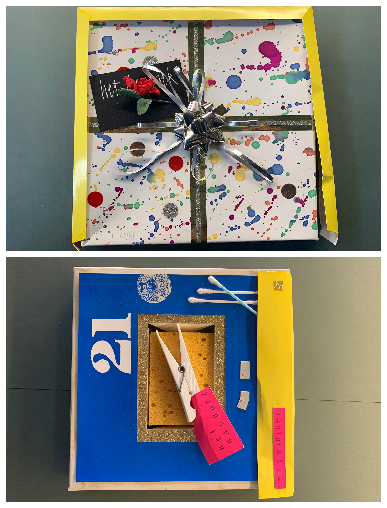

    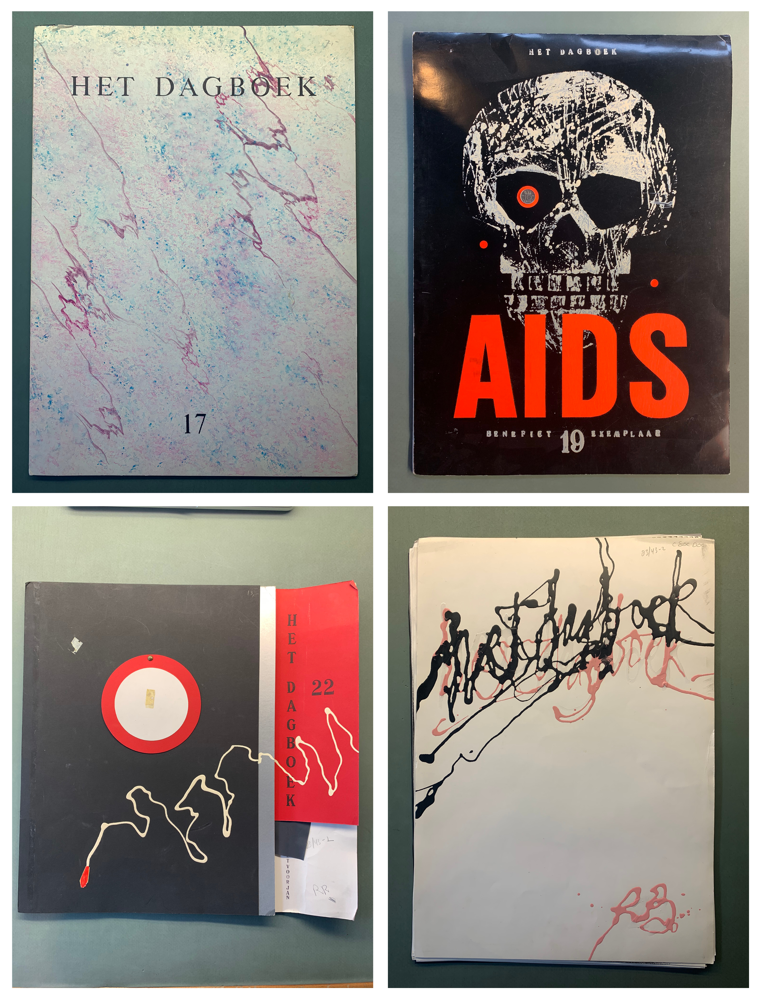

    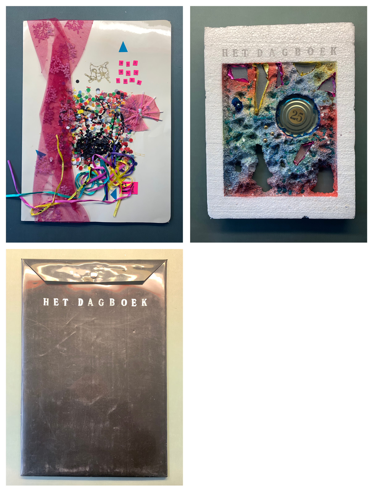

## The diary

Diaries, the from the Latin word dies for ‘day’, are records of daily life and opinions organized by date. The art of diary-keeping became popular in the 18th century, and the peak reached its pinnacle during the **[Victorian era](https://en.wikipedia.org/wiki/Victorian_era)**.

While diaries were usually meant to record the private thoughts of the diarist, they now give us important insights into historical events and the everyday life of the culture in which the diarist lived.

### IMD Transcoding ideas

- Little sculptures for each diary
    - A sculpture of all the diaries combined
- Drawings
- Paintings
- Digital version of the diary
- Protest signs with text from the diary
- Digital collages
- Poetry made with the highlighted words
- How would a diary in 2020 look (social media)

### Coding Transcoding ideas

- Digital diary website
    - An online platform where people could share there daily thought that they would normally write in a diary.
- Zines made with queer icons (a website where you could also print these zines)
    - [riot grrrl](https://www.theguardian.com/music/gallery/2013/jun/30/punk-music)
    - [pansy beat](https://i-d.vice.com/en_us/article/3k5djj/pansy-beat-zine-captured-the-80s-east-village-queer-scene) (queer zine from the 80's)
    - [J.D.s](https://www.dazeddigital.com/music/gallery/22438/1/j-d-s) (queer punk zine from the 80's)
- Instagram filter

## Queer zine

Zines made with queer icons (a website where you could also print these zines). A zine for the queer icons from today, but still made in the way they used to make zines in the 80's 

### References

- [riot grrrl](https://www.theguardian.com/music/gallery/2013/jun/30/punk-music)
- [pansy beat](https://i-d.vice.com/en_us/article/3k5djj/pansy-beat-zine-captured-the-80s-east-village-queer-scene) (queer zine from the 80's)
- [J.D.s](https://www.dazeddigital.com/music/gallery/22438/1/j-d-s) (queer punk zine from the 80's)
- [Queercore](https://en.wikipedia.org/wiki/Queercore)

    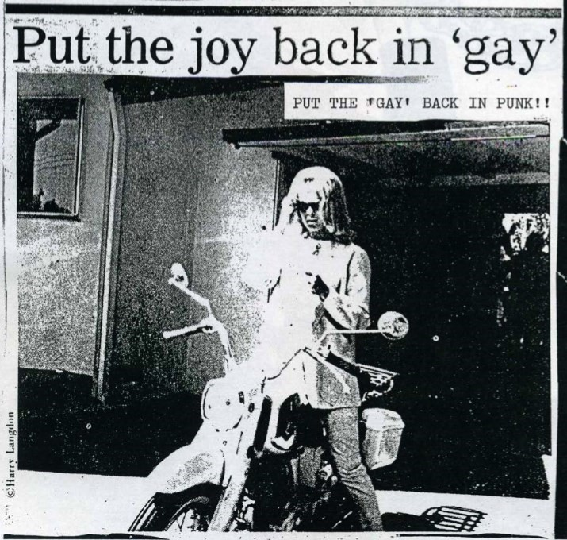

### Other ways of visualizing a diary in a digital way

- Instagram
- Twitter
- Snapchat
- Email
- Text message
- Notes app

### References

[Jonathan Puckey - Zeitgeist](https://www.jonathanpuckey.com/projects/zeitgeist/)

- Anne Frank diary

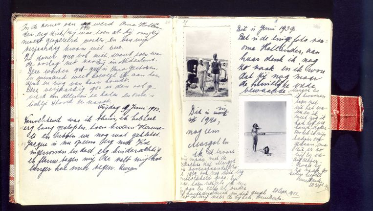

- [Twitter](https://twitter.com/explore)
- [Jaap Smit A Tweet History](https://jaapsmit.nl/A-Tweet-History)
- De klaagmuur

### [Diaries](https://drive.google.com/open?id=1hHOJIRWUvFfzKZ-ryD-QP0clewo_T_Ku)

[Dagboek 4](https://drive.google.com/open?id=1jL2Ia04yqGbvGp4LPPtJWrnr1xAIlL9K)

[Dagboek 6](https://drive.google.com/open?id=1VfEXZkEE5LiDxGG6hrjo8vP1f78obJ7O)

[Dagboek 7](https://drive.google.com/open?id=13Kfmw0j5gx7hyNvM_68fFLWTzBW5Hl0n)

[Dagboek 8](https://drive.google.com/open?id=15Mra7vcxcG5rI3Av3vNzdxOVC0_0j9SK)

[Dagboek 11](https://drive.google.com/open?id=1SA-EHMO7juG2xiUxubhIA_YpnYtUIYlr)

[Dagboek 12](https://drive.google.com/open?id=1RXlr4qXftxRyVUOK-kpwYu0_QHieJTaP)

[Dagboek 15](https://drive.google.com/open?id=1dJCjKYEG-ZN_C_vQFJZhMt282QZEq4mZ)

[Dagboek 16](https://drive.google.com/open?id=1WZiFZcn57UHUhTxR01gB_fxascJdvyE7)

[Dagboek 17](https://drive.google.com/open?id=1Topw_NSJZDL-ukW5X2jmyMkfPaZwoisz)

[Dagboek 18](https://drive.google.com/open?id=1xQ3K8iOl0qXnDdQY399dNjwx4x8FfDrC)

[Dagboek 19](https://drive.google.com/open?id=1RKJ0SQJsCfMMJUq2bR9W76388KvgOaX6)

[Dagboek 21](https://drive.google.com/open?id=1RN5euQ0hUyR3I-gY0h5MTVcG367m6VF5)

[Dagboek 22](https://drive.google.com/open?id=1wFLpPwkn5EUttv3og6VToPCvWMw2-VxF)

[Dagboek 23](https://drive.google.com/open?id=1jdsfsY8762tJP1Wqam8NJD-bXfe8axX-)

[Dagboek 24](https://drive.google.com/open?id=11B_ba2W2gQZ3mxFTRXHwxR9clnlXBLzZ)

[Dagboek 25](https://drive.google.com/open?id=1MLLm1TDXaG59q3rc7jYAydnmsx-14OnB)

[Dagboek 27](https://drive.google.com/open?id=126potfBo8df2M4HJ7eTtf0eTFB3gzGhK)

### [**Highlights**](https://drive.google.com/open?id=1EBAGRwMco0mOifoBnxlS4zuGgRCXDlpt)

[Dagboek 4](https://drive.google.com/open?id=1D7UlmAbFds6TN8uCEfH95s4eQzOAVvYs)

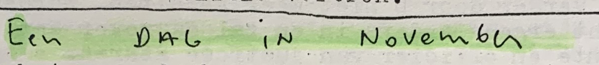

[Dagboek 6](https://drive.google.com/open?id=1em0Qao0aITw9y1VKatABhmieukTVqmGK)

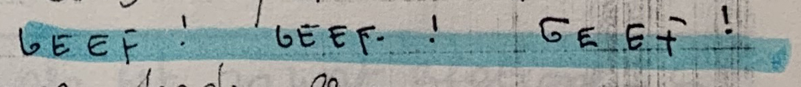

[Dagboek 7](https://drive.google.com/open?id=17d8SmLpjetZW1nHFlV_uOsQfwUnTGjad)

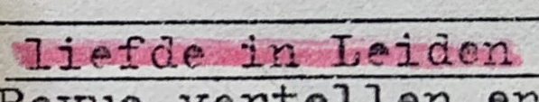

[Dagboek 8](https://drive.google.com/open?id=19fMP9E62p6R4m-M8d5gxC_vc76O8gKl8)

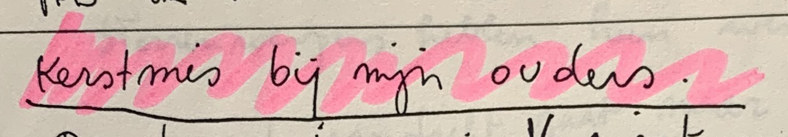

[Dagboek 12](https://drive.google.com/open?id=1wK7iAy3MsycSxDZsNOesr3jCFm895M3L)

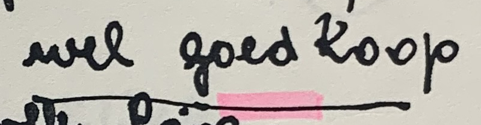

[Dagboek 15](https://drive.google.com/open?id=1O7QGETzamIo1UqGEYi4GOuxAfSBIwfNH)

[Dagboek 16](https://drive.google.com/open?id=1TNV9gXL1nNE6Qhgt2tthBX5wrjVTOxY_)

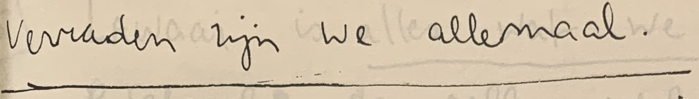

[Dagboek 18](https://drive.google.com/open?id=18VYK4yhFnxK7BiSpfzJuIl7c74gUGxDN)

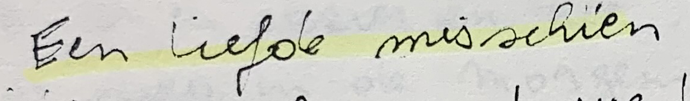

[Dagboek 22](https://drive.google.com/open?id=1H5gZ6XJ5AgDbxLz6lAWRFiSOZTs69Uer)

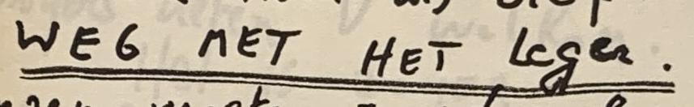

[Dagboek 23](https://drive.google.com/open?id=144cPu5D9XMHxfL9CB-WGNgB4_fgyPUQz)

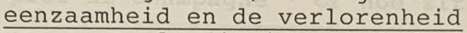

[Dagboek 27](https://drive.google.com/open?id=1BRbdGOMN9EFjez-CFRdZ336yVBfoAWgp)

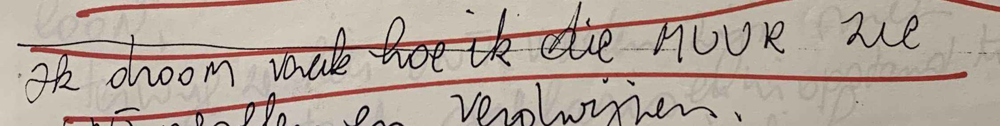

### Poetry made with highlighted text

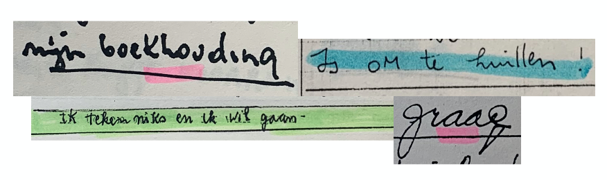

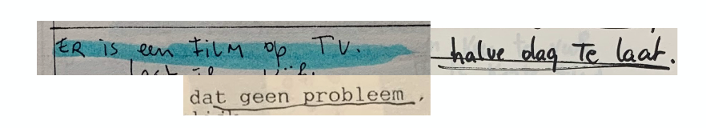

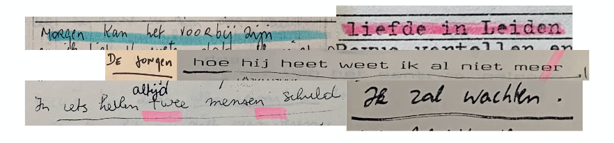

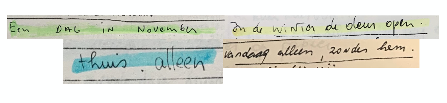

### Poetry website

A lot of the words and sentences Fabiola wrote already sound quit poetic. With this website you will be able to make your own poems. It will be a drag and drop website so you can place the words in the order you want to

### First sketch for website

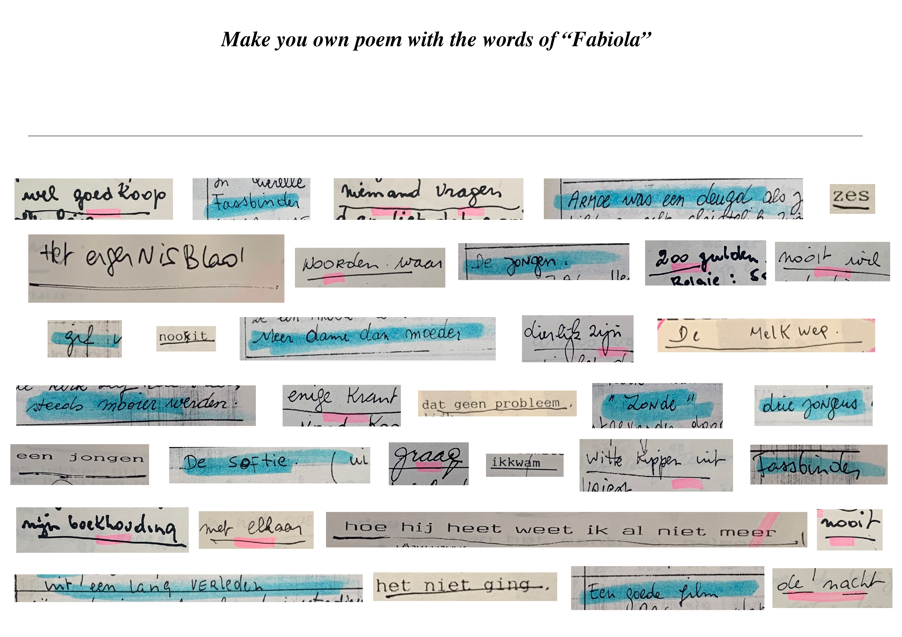

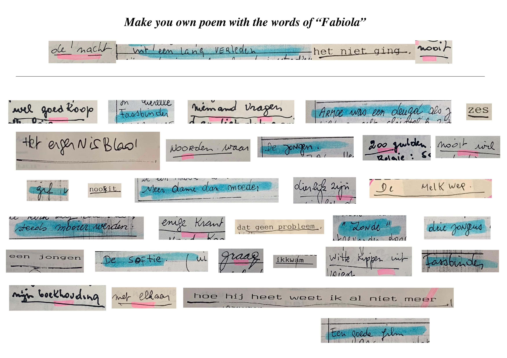

---

### [Handwriting](https://drive.google.com/open?id=1Udh3cnZNqDjgM3LXHD9NRoIuxXK2DndT)

[Dagboek 6](https://drive.google.com/open?id=1vu7Ia-_N5qjbh8D8Xzgv09XNoffySXT_)

[Dagboek 8](https://drive.google.com/open?id=1VnW4C_B93zyjOL5Aa54AXkH7E1vVfU3f)

[Dagboek 15](https://drive.google.com/open?id=1ZYcFAjhA5OHv2kj6Exr-IDH4Mq7fWNza)

[Dagboek 17](https://drive.google.com/open?id=1myrjGUer2xnoozQxOMOMg7j4a1SvhwXG)

[Dagboek 18](https://drive.google.com/open?id=1YfujfHoUY975xxm3Ix0GEoGdRgFij5im)

[Dagboek 19](https://drive.google.com/open?id=1kLl9pretLt0lsPRQMwsNxWKxhrjCujTK)

[Dagboek 22](https://drive.google.com/open?id=1RHy5gKQNrms03EcarRGyXV8i-xAjiktx)

[Dagboek 23](https://drive.google.com/open?id=1Y9qXsOEVZzMiF4LrfMtRE5xH7JOJ5m9J)

[Dagboek 27](https://drive.google.com/open?id=1b7WJVD3wOQ_Jt0ghjY_m7YhPl4TgFoRJ) 

### [Graphic elements](https://drive.google.com/open?id=1o5HMl8G_oqVXyIhMbSFRM_NFIOGznhX0)

[Dagboek](https://drive.google.com/open?id=1AXl3XA8U56u8v9W_doxrmcLcOhpewW2E) 6

[Dagboek 7](https://drive.google.com/open?id=1HQKy9Ok8GQew-zHxNE7MDe79gAX9i1Hr)

[Dagboek 8](https://drive.google.com/open?id=1EB47Iy96ZWI_BEwurA7wRZlPkmBaHLOW)

[Dagboek 15](https://drive.google.com/open?id=1TQzYOI1UkD9AaDwejLUZkamHFo_f-KmC)

[Dagboek 16](https://drive.google.com/open?id=1vLf-L8ZDuNBw4AMxrBkSWqfAeriTDJy9)

[Dagboek 17](https://drive.google.com/open?id=1uMIwUaP50L3ReHLJNejWOOoB8iIvyT8v)

[Dagboek 19](https://drive.google.com/open?id=1eyExIOP2XvvGxY-FTtpAsgGOt68_YSfy)

[Dagboek 22](https://drive.google.com/open?id=1iqDTcgqrvUjwlmnbiIycW2FaGGYcg0sq)

[Dagboek 23](https://drive.google.com/open?id=1BXVDlPg6fJ3KbTc4Glj4YpanlEy7-TJp)

### [Corrections](https://drive.google.com/open?id=1bLeweKP8g8pX6xAIUcqB0uQ8LqmtJHMj)

[Dagboek 4](https://drive.google.com/open?id=1s0RpSEanm3p8E1J7Zl0cYmq-4LTXeF6_)

[Dagboek 7](https://drive.google.com/open?id=1yUCVwStYpVTVEGbqU3m8kBmuAyNsjWw7)

[Dagboek 15](https://drive.google.com/open?id=16d9Qv3geLWgbQZyXG00cdP5w6lAMZRfp) 

---
## Paintings
### From diary to drawing, from drawing to painting, from painting to ...?
- other drawings

    [Drawing_01.pdf](Images/Drawing_01.pdf)

    [Drawing_02.pdf](Images/Drawing_02.pdf)

    [Drawing_03.pdf](Images/Drawing_03.pdf)

    [Drawing_04.pdf](Images/Drawing_04.pdf)

    [Drawing_05.pdf](Images/Drawing_05.pdf)

    [Drawing_06.pdf](Images/Drawing_06.pdf)

    [Drawing_07.pdf](Images/Drawing_07.pdf)

    [Drawing_08.pdf](Images/Drawing_08.pdf)

    [Drawing_09.pdf](Images/Drawing_09.pdf)

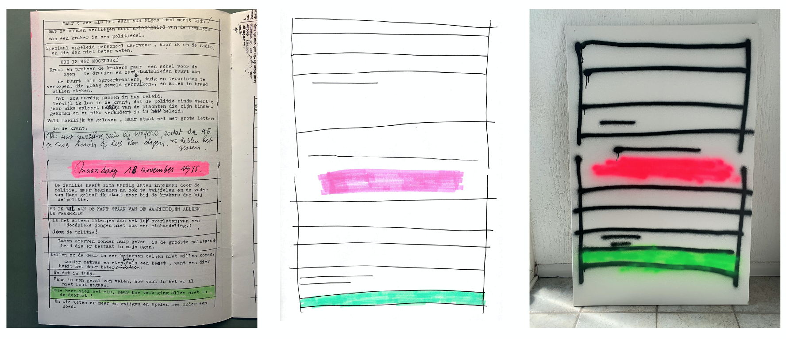

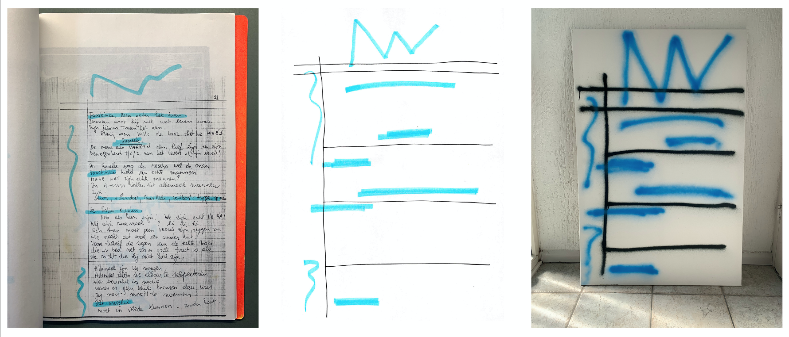

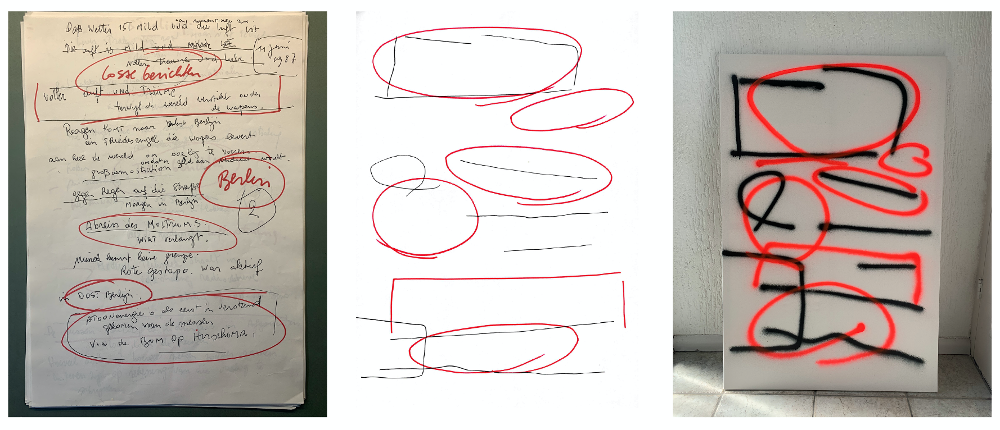

---

### Diary for the future

In the future people are going to look back at 2020 and try to imagine how it looked like. So having peoples private thoughts and opinions is crucial. 

### The website

A website where each day you can share your thoughts and feelings. I will be anonymous so no one will know who wrote what. All of the text people wrote will be made available to reed the day of the collectives.

### First sketch for website

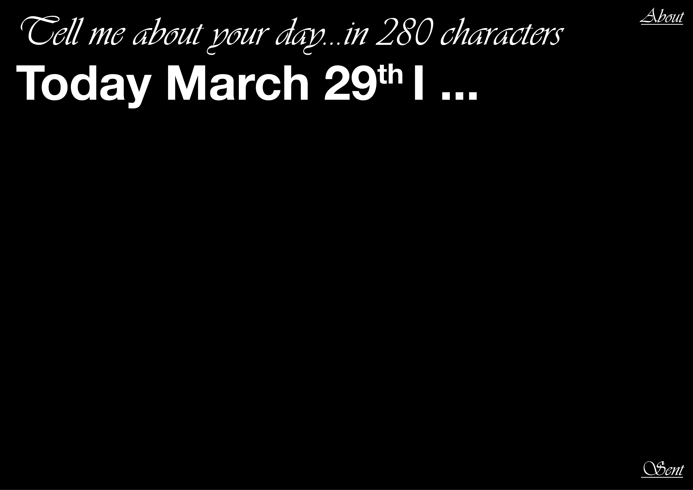

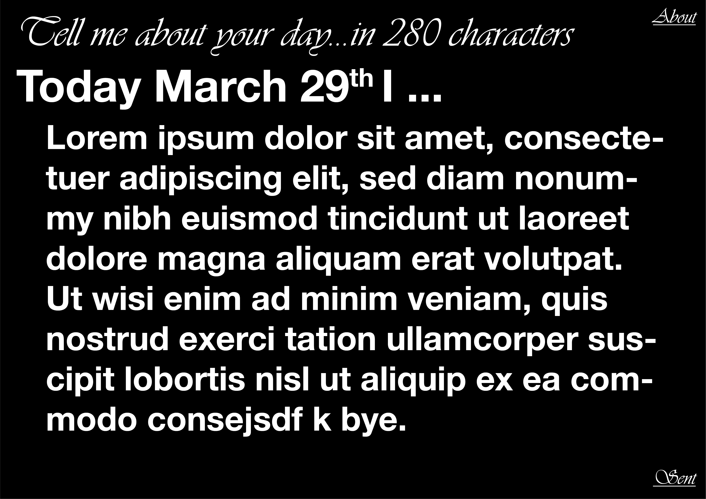

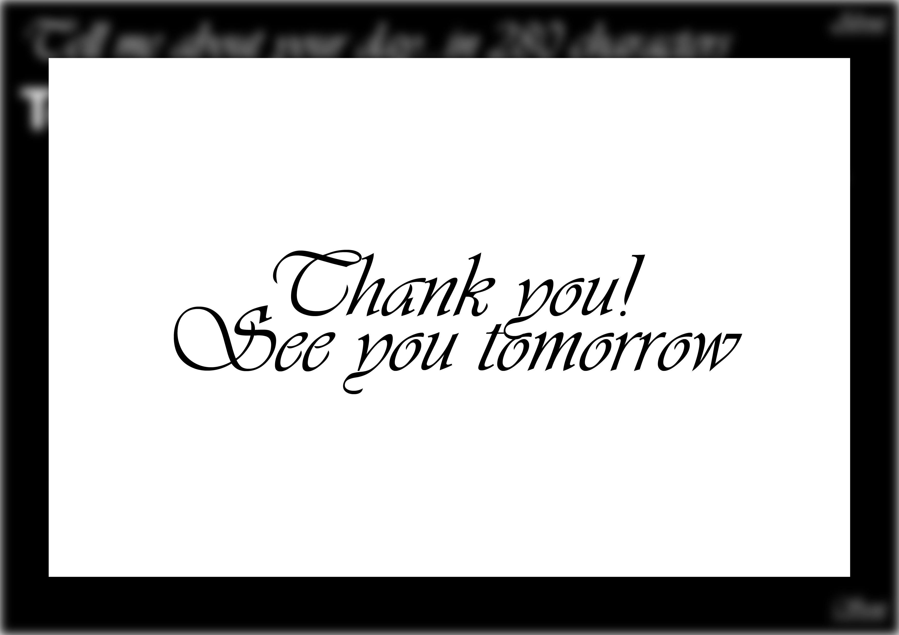

[Website](https://fabiolavdberg.github.io/Diaries_Fabiola/web/index.html)
---
